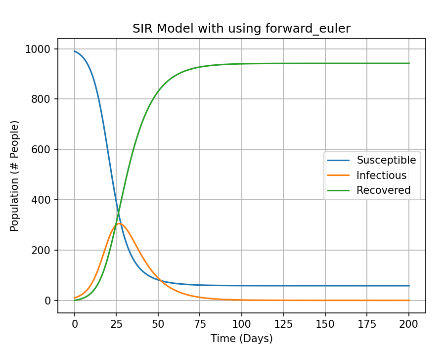

[](https://github.com/tomcodewizard/ODE-solvers/actions/workflows/os_versions.yml)
[](https://github.com/tomcodewizard/ODE-solvers/actions/workflows/python_versions.yml)
[](https://github.com/tomcodewizard/ODE-solvers/actions/workflows/style.yml)
[](https://ode-solvers.readthedocs.io/en/latest/?badge=latest)

# ODE Solvers

~Introduce here





## Using ODE-Solvers

~Explain how to use example scripts

~Images alongside examples - link to examples used in paper

## Installing ODE-Solvers

You can install from the repository, by typing the following into a command terminal:
```
$ git clone git@github.com:tomcodewizard/ODE-solvers.git
$ cd ODE-solvers
$ pip install -e .[dev,docs]
```

To uninstall, type:
```
$ pip uninstall ODE-solvers
```
